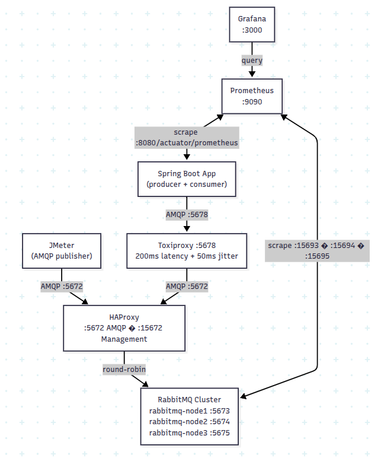

# RabbitMQ Channel Leak Demo

A minimal Spring Boot application created to reproduce a channel leak that occurs when using **publisher confirms** (`publisher-confirm-type: correlated`) during a RabbitMQ cluster failover.

## What this reproduces

When publisher confirms are enabled and the entire RabbitMQ cluster is restarted while messages are in-flight, AMQP channels accumulate and are never released — even after the cluster recovers and the application reconnects. This project provides a controlled environment to trigger and observe that leak.

## Architecture



- **3-node RabbitMQ cluster** (3.12.12) with HA policy and mirrored queues
- **HAProxy** load-balances AMQP connections across the three nodes
- **Toxiproxy** sits in front of HAProxy so network conditions can be injected; the Spring app connects through it (port `5678`)
- **Prometheus + Grafana** pre-configured to scrape per-object RabbitMQ metrics and display a channel-leak dashboard

## Requirements

| Tool | Notes |
|---|---|
| Java 21 | Required to build and run the Spring Boot app |
| IntelliJ IDEA | Recommended IDE |
| Docker + Docker Compose | Runs the full infrastructure stack |
| Apache JMeter | Load generator |
| [jmeter-amqp-plugin](https://github.com/aliesbelik/jmeter-amqp-plugin) | AMQP sampler for JMeter — install the JAR into JMeter's `lib/ext/` directory |

## How to run

### 1. Start the infrastructure

```bash
cd docker
docker compose up -d
```

This starts the RabbitMQ 3-node cluster, HAProxy, Toxiproxy, Prometheus, and Grafana. The cluster init container will automatically join the nodes and apply the HA policy — wait ~20 seconds for it to complete.

| Service | URL |
|---|---|
| RabbitMQ management (via HAProxy) | http://localhost:15672 (guest/guest) |
| Grafana | http://localhost:3000 (admin/admin) |
| Prometheus | http://localhost:9090 |

### 2. Start the Spring Boot application

With Gradle:
```bash
./gradlew bootRun
```

Or run `RabbitChannelLeakDemoApplication` directly from IntelliJ.

The app connects to RabbitMQ through Toxiproxy on port `5678` with `publisher-confirm-type: correlated`.

### 3. Run the failover test

```bash
./scripts/run-jmeter-rabbit-failover.sh
```

The script:
1. Starts JMeter in the background using `jmeter/channel-leak-test-plan.jmx`
2. Waits 90 seconds while messages flow normally
3. Stops all three RabbitMQ nodes simultaneously
4. Brings all services back up
5. Waits for JMeter to finish (hard cap of 300 seconds)
6. Writes results to `jmeter/results.jtl` and an HTML report to `jmeter/report/`

Open the Grafana dashboard at http://localhost:3000 to observe channel counts climbing and not returning to baseline after recovery.
